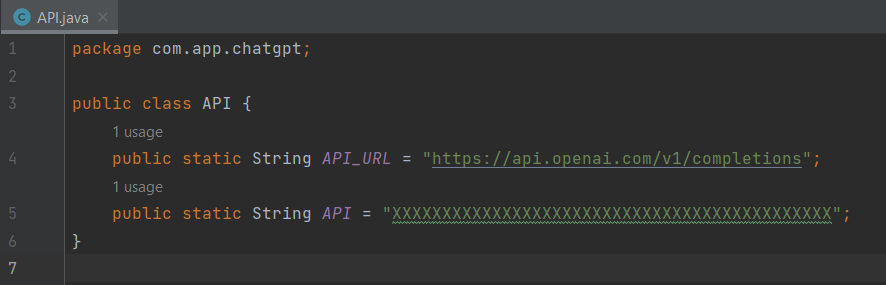

# ChatGPT-Android-app

🤖 Say hello to Chatbot AI, the innovative chatbot that allows you to easily ask questions and receive accurate and informative responses in real-time. Whether you need help with everyday tasks, want to learn something new, or just want to chat, Chatbot AI has got you covered.

# Instructions 
Open this project on Android Studio, And Use your API key here:

Without API key this app can't work.

This app uses third-party service API ( Open AI API ),
you can generate your own API Key from the official website https://platform.openai.com/account/api-keys

 